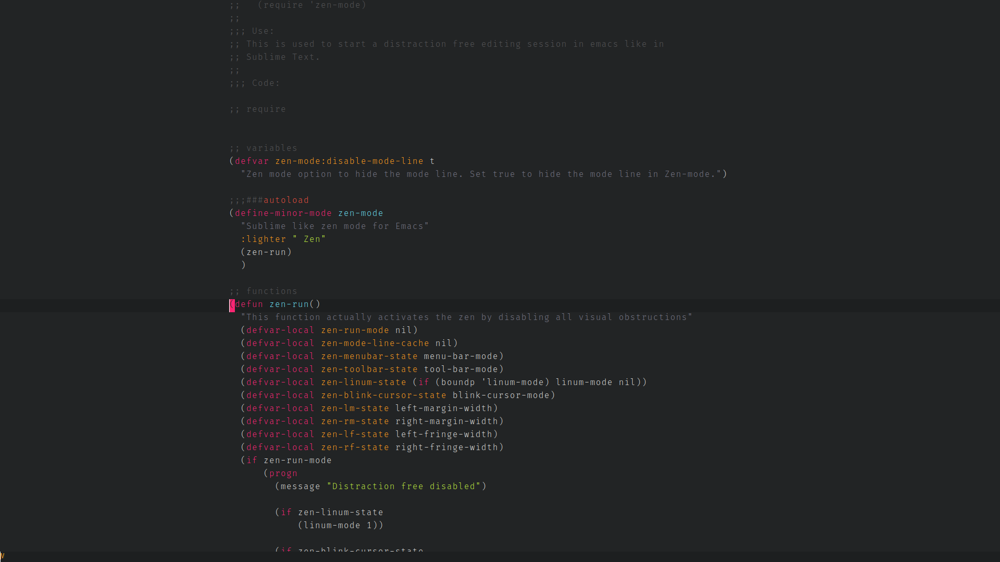
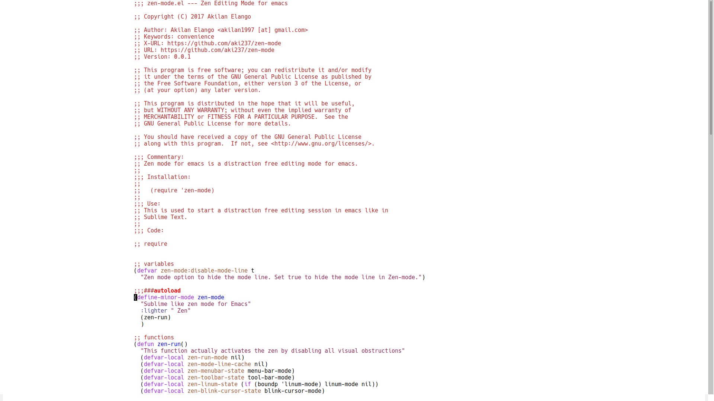

# Zen Mode

A simple emacs package for distraction free editing. Able to automatically resize the
editor span on window resize.



## Installation

Place the [zen-mode.el](zen-mode.el) file in the `load-path`, and in your configuration

```lisp
(require 'zen-mode)
```

To add a key binding, do the following :

```lisp
(global-set-key (kbd "C-M-z") 'zen-mode)
```

or just run `M-x zen-mode`

## Key bindings

+ `C-c C->` - Increases the editor span width (decreases the margin width)
+ `C-c C-<` - Decreases the editor span width (increases the margin width)

*Solarized themes look good*
